<div align="center">

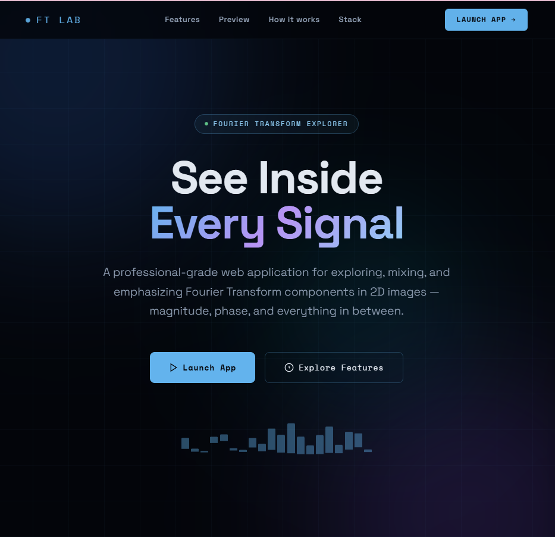

<br><br>

## 🔬 FT Lab – Fourier Transform Explorer

### Intelligent 2D Signal Processing & Fourier Analysis Platform

*Digital Signal Processing Course – Task 3: Fourier Transform Magnitude/Phase Mixer & Properties Emphasizer*

**Semester:** Spring 2026 | **Team:** 08

<br>

[](https://drive.google.com/file/d/1cUp_UdUHuRXPATCPRgAIJvulzFVGnrIr/view?usp=drive_link)

</div>

## 📋 Table of Contents

- [Project Overview](#-project-overview)
- [Home-Page](#-home-page)
- [Part A: FT Magnitude/Phase Mixer](#-part-a-ft-magnitudephase-mixer)
- [Part B: FT Properties Emphasizer](#-part-b-ft-properties-emphasizer)
- [Technical Implementation](#-technical-implementation)
- [Project Structure](#-project-structure)
- [Team](#-team)


---

## 📋 Project Overview

This project implements a comprehensive web-based laboratory for understanding the Fourier Transform and its applications in signal processing. By working with 2D signals (images), the application demonstrates the critical relationship between magnitude and phase components, frequency domain manipulation, and various signal processing operations.

The application is divided into two independent but integrated modes:

| Mode | Purpose |
|------|---------|
| **Part A - FT Magnitude/Phase Mixer** | Mix Fourier components from multiple images with customizable weights and frequency regions |
| **Part B - FT Properties Emphasizer** | Apply 11 different operations in either spatial or frequency domain |

This project helps students intuitively understand Fourier Transform concepts,
which are often difficult to grasp through equations alone.

---
## 🏠 Home Page

The landing page introduces the application and its features:

<div align="center">
  


*Navigation bar with mode switching and home button*

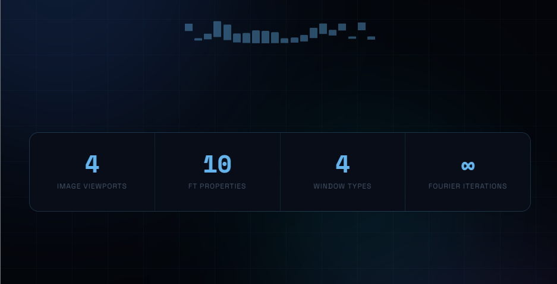

*Key statistics about the application capabilities*

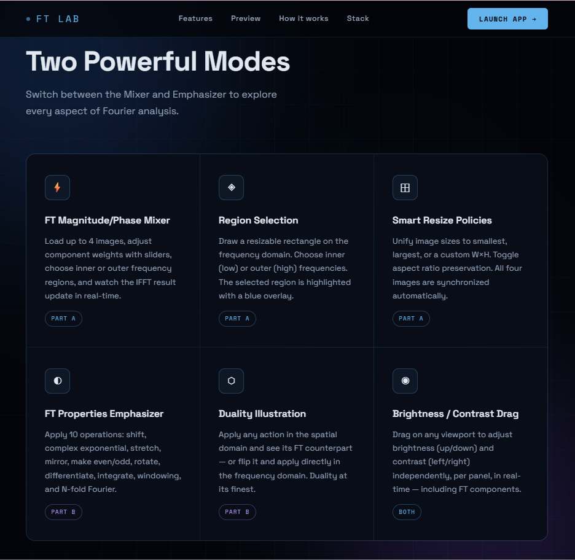

*Complete feature listing for both Mixer and Emphasizer modes*

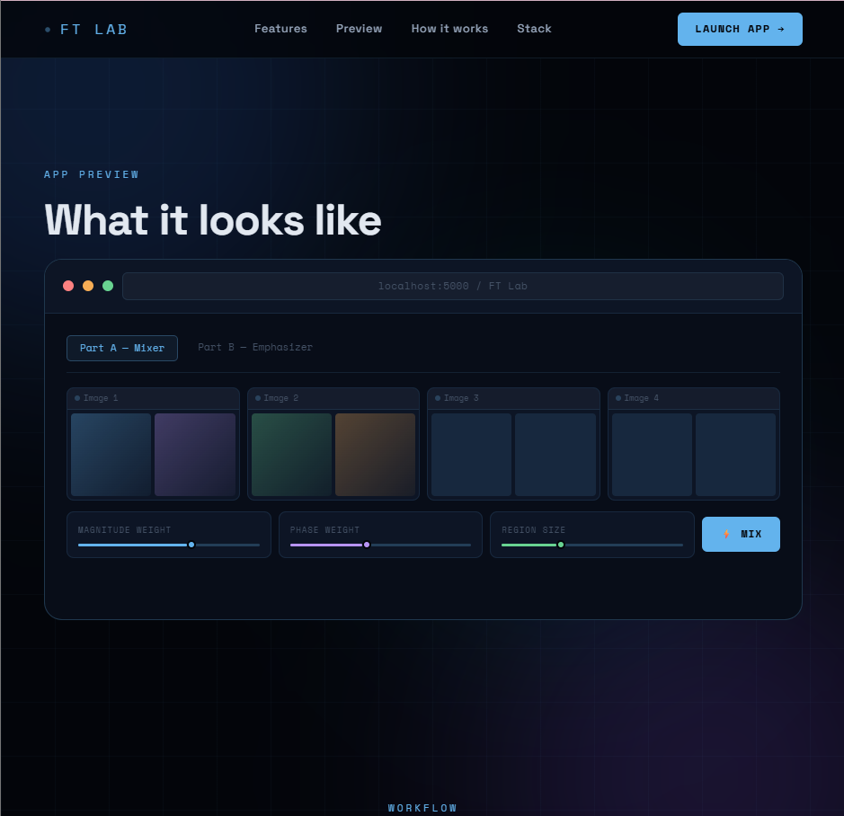

*Interactive preview of the application interface*

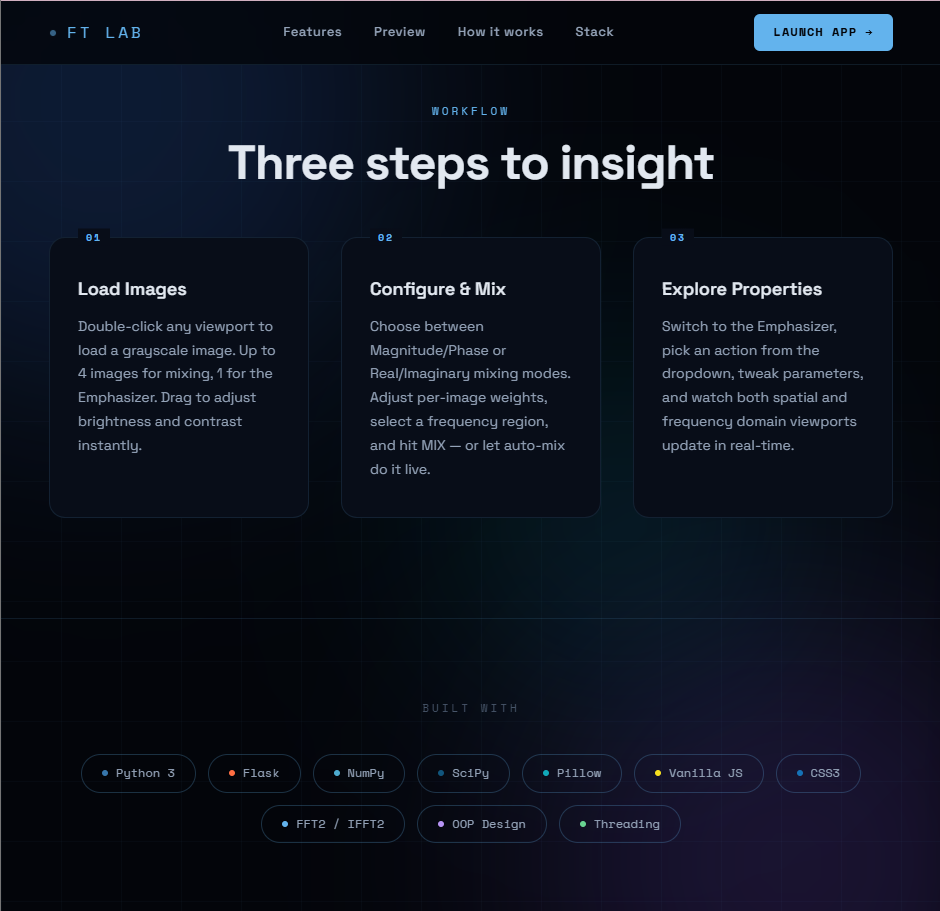

*Three-step workflow and technology stack overview*

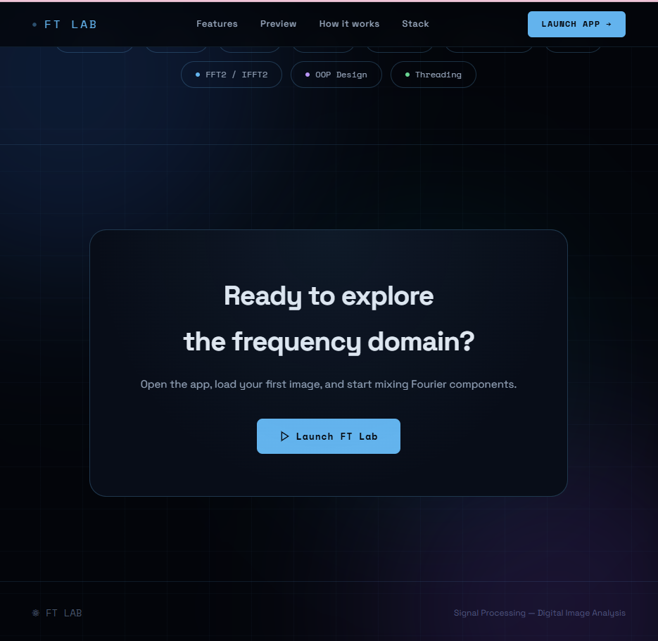

*Launch prompt section*

</div>

---
## 🎯 Part A: FT Magnitude/Phase Mixer

### Image Viewports

The application provides four input viewports, each containing two displays:

- **Left display:** Spatial domain image (fixed)
- **Right display:** Frequency domain component (selectable via dropdown)

Users can load images by double-clicking on any viewport. Each viewport operates independently, allowing different images in each slot.

<div align="center">
  


*Initial state showing four empty viewports waiting for images*

</div>

After loading images, the viewports display both spatial and frequency domain representations:

<div align="center">
  


*Images loaded in slots 1 and 2 with their FT magnitude displays*


*All four viewports populated with different images*

</div>

#### FT Component Selection

Each frequency domain display includes a dropdown menu offering four component visualizations:

- **FT Magnitude** – The amplitude spectrum |F(u,v)|, displayed with logarithmic scaling for better visualization of dynamic range
- **FT Phase** – The phase angle ∠F(u,v), revealing edge and structure information
- **FT Real** – The real part of the Fourier transform Re{F(u,v)}
- **FT Imaginary** – The imaginary part Im{F(u,v)}

<div align="center">
  


*Dropdown menu showing the four available FT component options*

</div>

This selection demonstrates that while magnitude and phase carry different types of information, both are essential for signal reconstruction.

#### Image Resizing and Unification

To ensure consistent mixing, all images must share the same dimensions. The application provides three resizing policies:

- **Smallest** – All images are resized to match the smallest dimensions among loaded images
- **Largest** – All images are resized to match the largest dimensions
- **Fixed Size** – User specifies custom width and height

<div align="center">
  


*Resize policy options: Smallest, Largest, and Fixed Size*

</div>

An additional "Keep Aspect Ratio" option preserves original proportions when enabled. This is particularly important for maintaining the visual integrity of the spatial domain images while still achieving uniform dimensions for frequency domain operations.

### Component Mixer

The core mixing functionality combines Fourier transforms of the four input images using weighted averages. Users control two weight parameters per image via intuitive sliders:

| Mix Mode | First Weight | Second Weight |
|----------|--------------|----------------|
| Magnitude & Phase | Magnitude contribution | Phase contribution |
| Real & Imaginary | Real part contribution | Imaginary part contribution |

<div align="center">
  


*Selecting between Magnitude & Phase or Real & Imaginary mixing modes*


*Real and Imaginary mixing mode interface with weight sliders*

</div>

The mixing formula differs based on the selected mode:

- **Magnitude & Phase Mode:** Combined FT = Σ [ |F_i| · w_a · e^{j (∠F_i · w_b)} ]
- **Real & Imaginary Mode:** Combined FT = Σ [ Re(F_i) · w_a + j · Im(F_i) · w_b ]

The output image is obtained by applying the inverse Fourier transform (IFFT) to the combined frequency domain representation.

### Frequency Region Selection

Users can choose which portion of the frequency spectrum contributes to the mix:

- **Inner Region (Low Frequencies)** – Corresponds to smooth variations, overall shape, and global structures
- **Outer Region (High Frequencies)** – Corresponds to fine details, edges, textures, and noise

<div align="center">
  


*Inner vs Outer frequency region selection*


*Blue semi-transparent rectangle indicating selected frequency region overlay on FT display*

</div>

A rectangular region is overlaid on each FT display with semi-transparent blue coloring to indicate the selected area. The region size is adjustable via slider from 5% to 95% of the total frequency range. This region selection is unified across all four images, ensuring consistent frequency contributions.

### Output Ports

Two independent output viewports are available. The user selects which port receives the mixing result via toggle buttons. Each output port mirrors the input viewport design:

- Left display shows the spatial domain result (the IFFT of the combined FT)
- Right display shows any selected FT component of the result (Magnitude, Phase, Real, or Imaginary)

<div align="center">
  


*FT component selection for output ports*

</div>

A save button allows downloading the output image as a PNG file. When a new mix result is generated, the non-active output port displays a visual "outdated" indicator.

### Mixing Results

The following shows actual mixing results combining two images with different weight configurations:

<div align="center">
  


*Mixing result displayed in Output 1 using Real & Imaginary mode with Outer region selected*

</div>

### Brightness and Contrast Control

In any viewport (spatial or frequency domain), users can adjust the display's brightness and contrast through mouse dragging:

- **Vertical drag** – Adjusts brightness (up = brighter, down = darker)
- **Horizontal drag** – Adjusts contrast (right = higher contrast, left = lower contrast)

This functionality, often referred to as window/level adjustment in medical imaging, uses CSS filters for immediate visual feedback during dragging, followed by a server-side re-render on mouse release to ensure accurate display of the actual data values.

### Real-time Mixing and Thread Management

The mixing operation involves computationally intensive FFT and IFFT calculations. The application handles this through:

- **Automatic triggering** – Any parameter change (weights, region, mix mode) automatically initiates a new mix after a brief debounce period (400ms)
- **Progress indicator** – A visual progress bar shows the operation status
- **Thread cancellation** – If a new mixing request arrives while a previous operation is still running, the previous operation is immediately cancelled and the new one begins
- **Lag simulation** – An optional "Simulate Lag" setting adds a 10-second delay, allowing testing of thread cancellation behavior even on fast machines

---
## 🎯 Part B: FT Properties Emphasizer

The Emphasizer provides a dedicated environment for exploring 11 distinct signal processing operations. Users can apply any operation to either the spatial domain image or directly to its Fourier transform, demonstrating the duality between the two domains.

### Initial Interface

<div align="center">
  
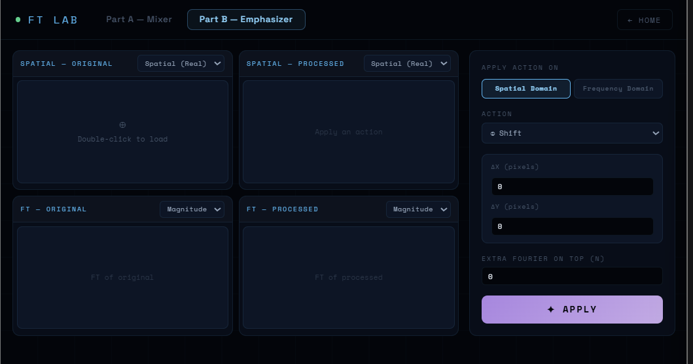

*Initial Emphasizer interface with four empty viewports*

</div>

### Loading an Image

<div align="center">
  
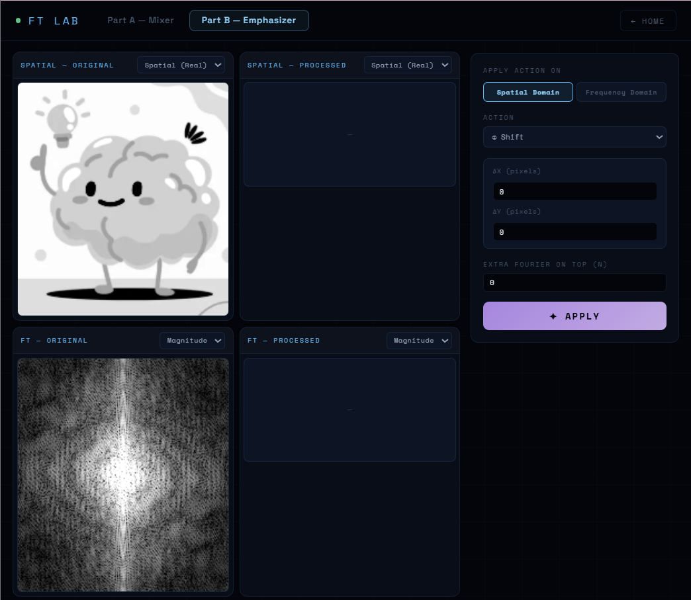

*After loading an image – spatial original and its FT are displayed*

</div>

### Domain Selection and Duality

A toggle switch allows users to choose the application domain:

- **Spatial Domain** – The operation is applied to the spatial image; the Fourier transform updates automatically
- **Frequency Domain** – The operation is applied directly to the FT; the spatial image updates via inverse transform

The interface visually indicates which panel serves as the input source (highlighted with a blue border) and which panels display derived results. This design makes the duality property of the Fourier transform immediately apparent.

### Action Selection

<div align="center">
  
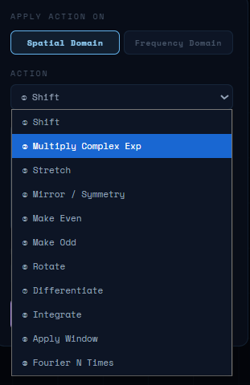

*Complete list of 11 available operations in the action selector*

</div>

### Four Viewer Ports

| Port | Content | Component Options |
|------|---------|-------------------|
| Spatial - Original | Source image in spatial domain | Spatial, Magnitude, Phase, Imaginary |
| Spatial - Processed | Result after operation | Spatial, Magnitude, Phase, Imaginary |
| FT - Original | Fourier transform of source | Magnitude, Phase, Real, Imaginary |
| FT - Processed | Fourier transform of result | Magnitude, Phase, Real, Imaginary |

<div align="center">
  
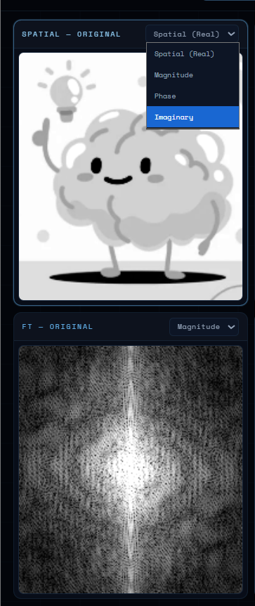

*Component selector dropdowns on all four viewports*

</div>

Each port includes a dropdown selector for viewing different components. For spatial ports, magnitude and phase become available when the image data becomes complex (e.g., after certain frequency domain operations), with a visual badge indicating complex-valued content.

### Available Operations with Examples

#### 1. Shift
Shifts the image by specified pixel amounts in horizontal and vertical directions. Parameters: ΔX (pixels), ΔY (pixels). In the frequency domain, shifting corresponds to multiplication by a linear phase factor.

<div align="center">
  


*Shift operation applied in spatial domain*


*Shift operation applied in frequency domain*

</div>

#### 2. Complex Exponential Multiplication
Multiplies the signal by e^(j2π(u₀x + v₀y)), where u₀ and v₀ are user-specified frequencies. This operation shifts the Fourier transform in the frequency domain, demonstrating the modulation property.

<div align="center">
  


*Complex exponential multiplication interface*


*Complex exponential operation applied in frequency domain*

</div>

#### 3. Stretch
Scales the image by factors sx and sy (0.1 to 5.0). In the frequency domain, stretching corresponds to inverse scaling of the FT, illustrating the scaling property.

<div align="center">
  


*Stretch operation applied in spatial domain*


*Stretch operation applied in frequency domain*


*Stretch operation showing magnitude component in spatial domain*

</div>

#### 4. Mirror / Symmetry
Creates symmetric patterns by duplicating the image across selected axes. Options: horizontal (left-right mirror), vertical (up-down mirror), or both axes simultaneously.

<div align="center">
  


*Mirror operation applied in spatial domain*


*Mirror operation applied in frequency domain*


*Mirror operation in frequency domain showing spatial component*

</div>

#### 5. Make Even / Make Odd
Creates even symmetry (f(x,y) = f(-x,-y)) or odd symmetry (f(x,y) = -f(-x,-y)) around the image center using 180-degree rotational duplication.

<div align="center">
  


*Make Even operation result*


*Make Odd operation result*

</div>

#### 6. Rotate
Rotates the image by any integer angle between 0 and 360 degrees. The canvas automatically expands to accommodate the rotated image without cropping.

<div align="center">
  


*Rotate operation applied in spatial domain*


*Rotate operation applied in frequency domain*

</div>

#### 7. Differentiate
Computes the derivative along the X-axis (∂f/∂x) or Y-axis (∂f/∂y) using frequency domain multiplication by j2πu (or j2πv). This acts as an edge detection operator.

<div align="center">
  


*Differentiate operation result showing edge detection*

</div>

#### 8. Integrate
Computes the cumulative integral along the specified axis using frequency domain division by j2πu (or j2πv). This operation smooths the signal and emphasizes low-frequency components.

<div align="center">
  


*Integrate operation applied in spatial domain*

</div>

#### 9. Window Operations
Multiplies the image by a customizable 2D window function with complete parameter control for each window type.

<div align="center">

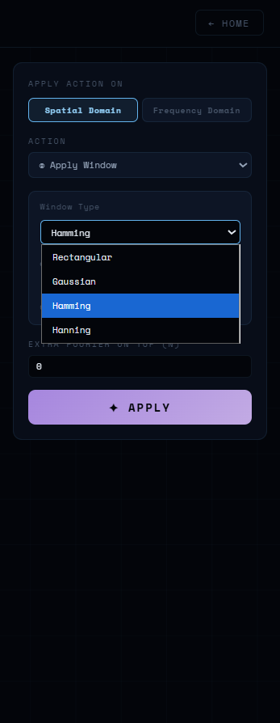

*Window types: Rectangular, Gaussian, Hamming, and Hanning*

.png)

*Rectangular window configuration interface*

.png)

*Hamming window configuration interface*

</div>

##### Hamming Window with Alpha Parameter

<div align="center">

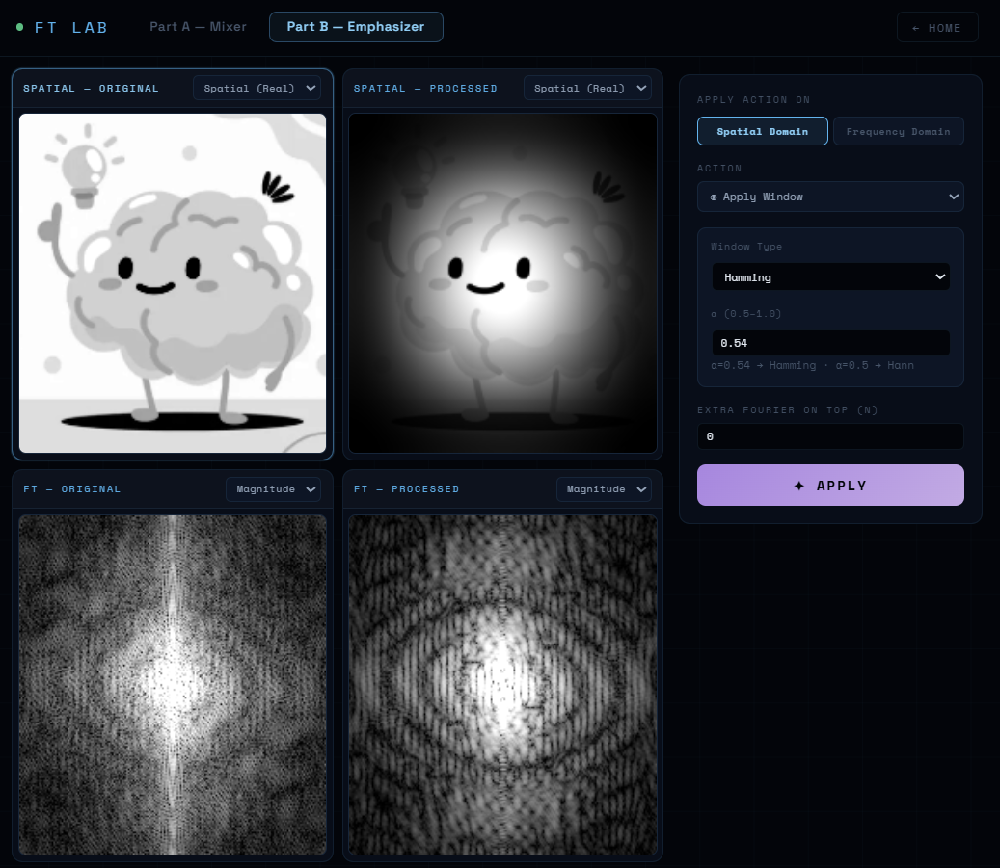

*Hamming window configuration with α parameter control (0.54 = standard Hamming)*

</div>

The Hamming parameter α allows continuous variation between rectangular (α=1) and Hann (α=0.5) windows. The Hanning parameter β controls the flattening of the window top (β=1 gives standard Hanning, β>1 produces a flatter top).

#### 10. Fourier N Times
Applies the Fourier transform repeatedly N times (1 to 8 repetitions). This operation can be applied on top of any other action.

<div align="center">
  


*Fourier N Times configuration interface*


*Result after applying multiple Fourier transforms*

</div>

### Real-time Auto-apply

All parameter changes in the Emphasizer automatically trigger re-application of the selected operation after a brief debounce period. This provides immediate visual feedback while maintaining performance.

---

## 💻 Technical Implementation

### Backend Architecture

The backend is built with Flask and implements a clean object-oriented design. All mathematical operations are encapsulated within the `FTImage` class, ensuring no code repetition and clear separation of concerns.

#### FTImage Class

This class manages all image data and frequency domain operations:

- Stores the original image, resized working array, and Fourier transform
- Handles loading from base64 data URLs
- Provides resize functionality with aspect ratio preservation
- Extracts FT components (magnitude, phase, real, imaginary)
- Applies frequency region masking
- Implements spatial and frequency domain actions through a unified dispatcher
- Generates 2D window functions with full parameter control
- Provides static methods for mixing multiple Fourier transforms

The `_dispatch_action()` method is a key design element that eliminates code repetition. It handles both spatial and frequency domain operations using a single implementation, with domain-specific branches only where mathematically necessary.

#### Mixer Class

This class encapsulates all threading orchestration for the mixing process:

- Manages job submission with automatic cancellation of previous operations
- Provides polling mechanism for job status
- Runs mixing operations in background threads
- Handles cancellation events cleanly

### Frontend Implementation

The frontend uses vanilla JavaScript with no external dependencies, ensuring lightweight and efficient operation. Key features include:

- Drag-based brightness and contrast adjustment with CSS filter feedback
- Server-side re-rendering on mouse release for accurate display
- Debounced auto-mix triggering for responsive parameter changes
- Progress bar visualization for long operations
- Stale badge indicators for output ports
- Domain switching with visual input role highlighting

### Thread Safety

The application properly handles concurrent operations:

- Each mixing job receives a unique cancellation event
- New jobs cancel previous jobs before starting
- The backend checks cancellation status at multiple points during processing
- Frontend polling continues until job completion or cancellation

---

## 📁 Project Structure

```
FT-Lab/
├── app.py                 # Flask backend with FTImage and Mixer classes
├── requirements.txt       # Python dependencies
├── templates/
│   ├── home.html         # Landing page
│   └── index.html        # Main application interface
├── static/
│   ├── app.js            # Frontend logic
│   └── style.css         # Styling
└── images/
    ├── Home/             # Landing page screenshots
    ├── Part A _Mixer/    # Part A screenshots
    └── PartB_Mixer/      # Part B screenshots
```

---

## 🔧 Installation

### Prerequisites
- Python 3.9 or higher
- pip package manager

### Setup Instructions

1. **Install dependencies**
   ```bash
   pip install -r requirements.txt
   ```

2. **Run the application**
   ```bash
   python app.py
   ```

3. **Open your browser** and navigate to `http://localhost:8000`

### Dependencies

The application requires only four external Python packages:
- **Flask** – Web framework for REST API endpoints
- **NumPy** – Array operations and FFT/IFFT calculations
- **Pillow** – Image loading, saving, and resizing
- **SciPy** – Advanced operations including rotation

---

## 👨‍💻 Team

**Course:** Digital Signal Processing  
**Semester:** Spring 2026  
**Task:** Task 3 – Fourier Transform Magnitude/Phase Mixer and Properties Emphasizer  
**Team:** 08  

---

<div align="center">

## 🌟 Thank You for Reviewing Our Project

For questions or support, please contact Team 08

**FT Lab © 2026 Team 8 DSP. All rights reserved.**

</div>
